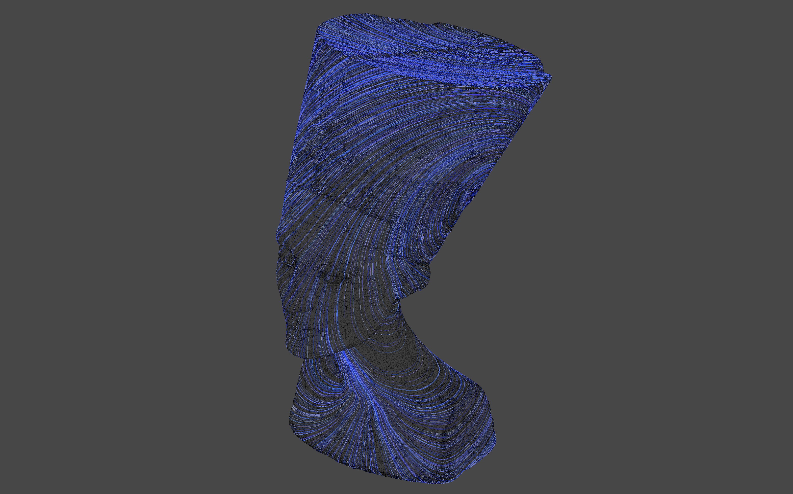

# unity-vectorfield
 

Unity-vectorfield is vector field generator on mesh and set of its oparators. It allows you to quick implementation of differecial geometry argolithms on Unity3d, then instantly applying to game programmings or media art creations. This library is heavily Inspired by [Keenan Crane's Lectures at CMU](https://www.cs.cmu.edu/~kmcrane/Projects/DDG/) and [Polyscope](https://github.com/nmwsharp/polyscope) and referencing a lot from them.

## Features
This library contains features below: 
- Halfedge structure (as very core and standalone module)
- Curvature culclation (Gausian / Mean / Principal / Normal)
- Vector field generator by solving Poisson equation on mesh
- Hodge decomposition for a given tangent field 
- Basis finder for Hamonic component
- Basis finder for Homology group
- Trivial connection generator
- Ribbon drawer on a given vector field 

## Installation & Usage
For installation, put the following address to UnitPackageManager.  
`https://github.com/komietty/unity-vectorfield.git?path=/Packages/VectorField`

To check the samples under Assets/Samples, just clone this repo and run.
