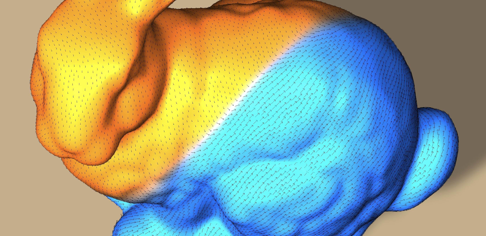

# unity-vectorfield
 

Unity-vectorfield is vector field library, consisting of vector field generators on mesh and operators for them. It allows you to quick implementation of vector field algorithms on Unity, which instantly applicable to game programming, media art creation, or physical simulation. This library refers a lot from [Lectures at CMU](https://www.cs.cmu.edu/~kmcrane/Projects/DDG/) and [GeometryCentral](http://geometry-central.net/).

## Features
Based on **Halfedge structure** and **Discrete exterior calclus**. 

Beware some of the original algorithms refered here supports several geometric representations like point cloud or voxel grid, but this implementation only supports triangulated surface mesh.

- **Helmholtz-Hodge decomposition** - An implementaion of hodge decomposion which you can learn in differencial geometry text book. Discretization process is nicely explained in the [lectures notes](https://www.cs.cmu.edu/~kmcrane/Projects/DDG/).

- **Trivial connection** - A vector transport method as smooth as possible, from the paper by Keenan et al. (2010). 

- **Scalar heat method** - A Distance computing method using heat method, from the [paper](https://www.cs.cmu.edu/~kmcrane/Projects/HeatMethod/index.html) by Keenan et al. (2017).

- **Vector Heat Method** - Another parallel transport algorithm using heat method, from the [paper](https://www.cs.cmu.edu/~kmcrane/Projects/VectorHeatMethod/paper.pdf) by Nicolas et al. (2019). Right now the implimentation on this library supports closed surface for any genesis. It is possible to find c++ implementation by original author [here](https://github.com/nmwsharp/geometry-central).

- **Misc** - Curvature culclation (Gausian / Mean / Principal / Normal) / Vector field generator by solving Poisson equation on mesh / Basis finder for Hamonic component / Basis finder for Homology group / Ribbon drawer on a given vector field 

## Installation & Usage
For installation, put the following address to UnitPackageManager.  
`https://github.com/komietty/unity-vectorfield.git?path=/Packages/VectorField`

To check the samples under Assets/Samples, just clone this repo and run.
