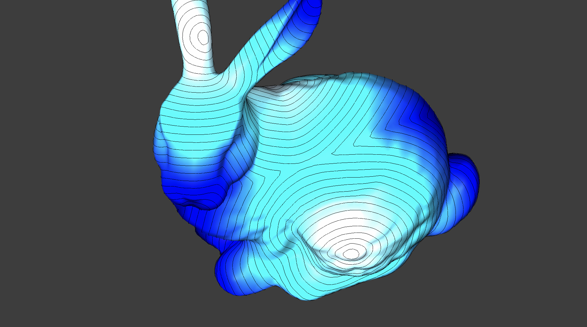
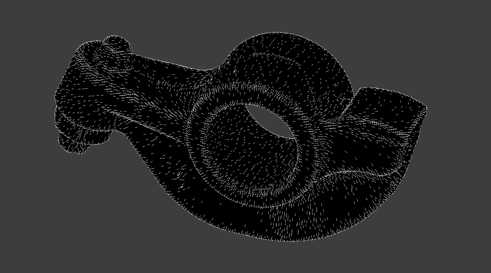
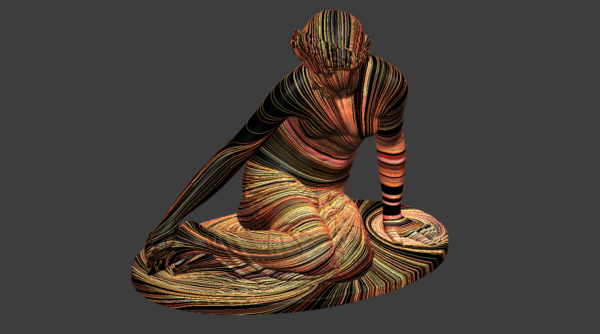
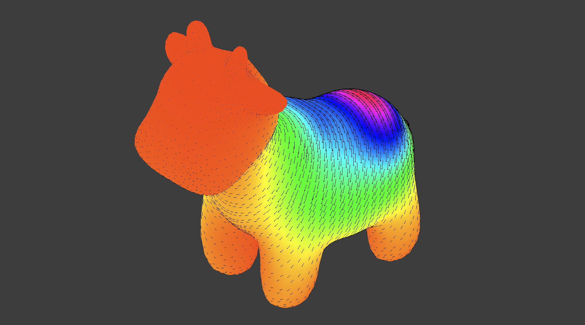
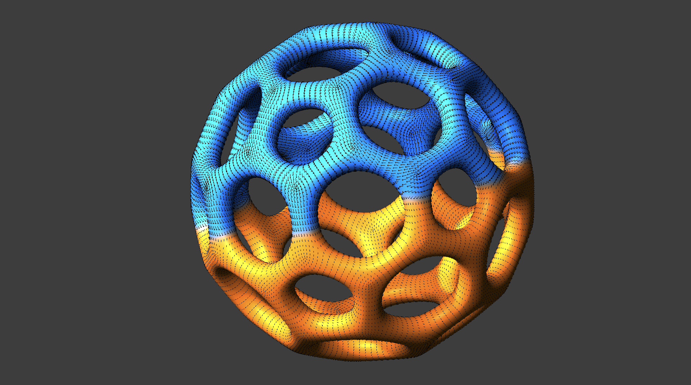
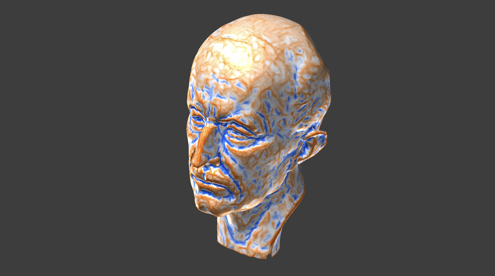

# unity-vectorfield
 

Unity-vectorfield is a vector field library, consisting of vector field generators on mesh and operators for them. It allows you to quick implementation of vector field algorithms on Unity, which is instantly applicable to game programming, media art creation, or physical simulation. This library refers a lot to [Lectures at CMU](https://www.cs.cmu.edu/~kmcrane/Projects/DDG/) and [GeometryCentral](http://geometry-central.net/).

## Features
This library is for vector field design especially parallel transport, based on  **Halfedge structure** and **Discrete exterior calculus**. Beware some of the original algorithms referred to here support some geometric representations like point cloud or voxel grid, but this library only supports triangulated closed surface mesh with any genesis right now (meaning closed meshes with holes like torus. surface with boundaries will be supported soon). The main solvers are below.

- **Hodge decomposition** - An implementation of hodge decomposition, that is the oparation decomposing arbitrally vector field into exact componet (divergent part), coexact component (rotation part), and harmonic component.  The theory in continus mathematics could be find in differential geometry textbooks, and the discretization process is nicely explained in the [lecture notes](https://www.cs.cmu.edu/~kmcrane/Projects/DDG/).

- **Trivial connections** | [Paper](https://www.cs.cmu.edu/~kmcrane/Projects/TrivialConnections/) by Keenan et al. (2010) - A vector transport method to generate as smooth as possible vector field with some singularity points. It is possible to choose value and place of sigularity points as long as they satisfy Gauss-bonnet theorem.

- **Smooth vector field** | [Papaer]() by Keenan et al. (2013) - 

- **Scalar heat method** | [Paper](https://www.cs.cmu.edu/~kmcrane/Projects/HeatMethod/index.html) by Keenan et al. (2017) - A shortest distance computing method using the heat method for single or multiple-source on both flat and curved domains.

- **Vector heat method** | [Paper](https://www.cs.cmu.edu/~kmcrane/Projects/VectorHeatMethod/paper.pdf) by Nicolas et al. (2019) - Another parallel transport algorithm using the heat method. The C++ implementation by the original author is [here](https://github.com/nmwsharp/geometry-central).

- **Killing vector filed** | [Paper]() by Ben-Chen et al. (2010) - 

Other features and miscellaneous include curvature calculation (Gaussian / Mean / Principal / Normal), vector field generator by solving Poisson equation on mesh, basis finder for harmonic component, basis finder for homology group, ribbon drawer, etc. 

## Installation & Usage
For installation, put the following address to UnitPackageManager.  
`https://github.com/komietty/unity-vectorfield.git?path=/Packages/VectorField`

To check the samples under Assets/Samples, just clone this repo and run.

 
 
 
 
 
 
 
