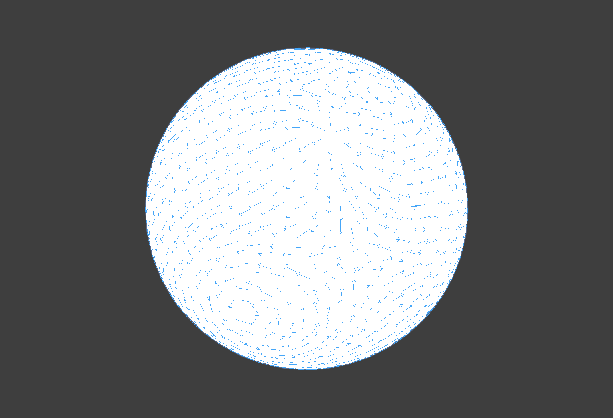
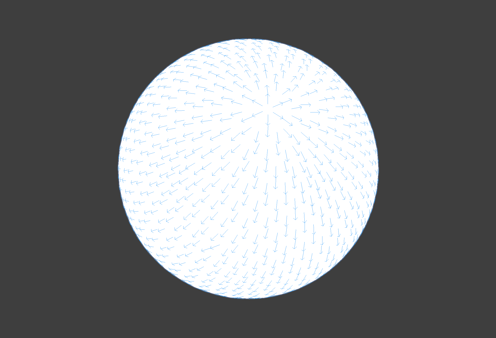
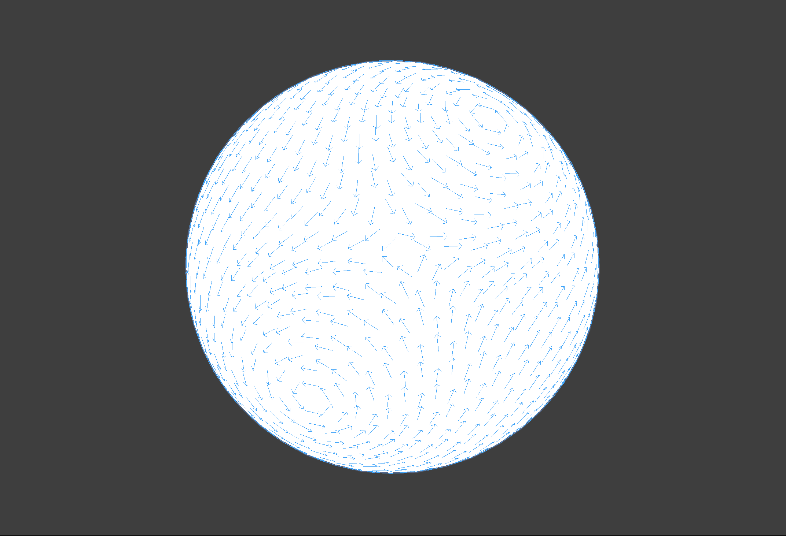

# MonoManifold 

Geometory processing library on Unity. 

### Curvature Culclation (Gausian / Mean / Principal / Normal)

### Poisson Equation Culclation and Smooothing

### Tangent Field Decomposition (Hodge Decomposition)
 
 
 

## References
- [Discrete Differential Geometry: An Applied Introduction - Keenan Crane](https://www.cs.cmu.edu/~kmcrane/Projects/DDG/)

- 森田茂之, 微分形式の幾何学