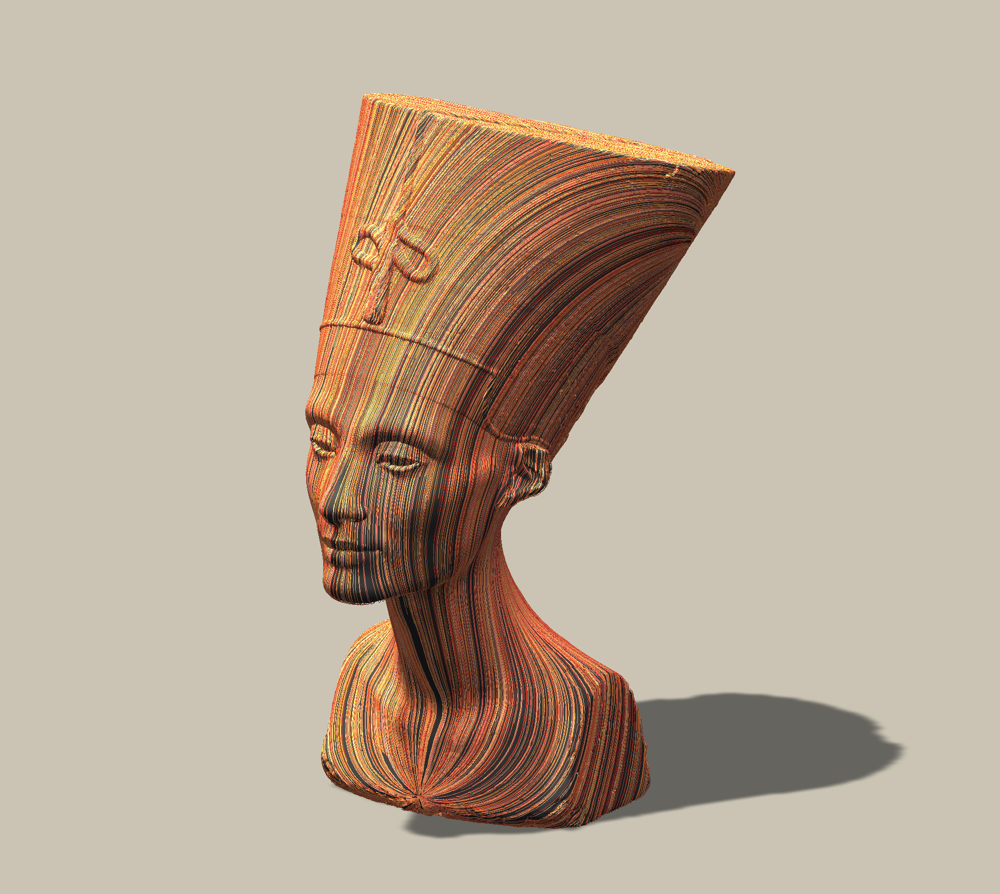

# unity-vectorfield
 

Unity-vectorfield is vector field utility library, consisting of vector field generators on mesh and operators for them. It allows you to quick implementation of differential geometry algorithms on Unity, which instantly applicable to game programming, media art creation, or physical simulation. This library is heavily Inspired by [Keenan Crane's Lectures at CMU](https://www.cs.cmu.edu/~kmcrane/Projects/DDG/) and [Polyscope](https://github.com/nmwsharp/polyscope) and referencing a lot from them.

## Features
- ### Random vector field generator and is decomposition
- ### Distance computing with heat method
- ### Pararell transport of vector (Trivial connection)
- ### Pararell transport of vector (Vector heat method)
- ### And other misc!

<!--
This library contains features below: 
- Halfedge structure (as very core and standalone module)
- Curvature culclation (Gausian / Mean / Principal / Normal)
- Vector field generator by solving Poisson equation on mesh
- Hodge decomposition for a given tangent field 
- Basis finder for Hamonic component
- Basis finder for Homology group
- Trivial connection generator
- Ribbon drawer on a given vector field 
-->

## Installation & Usage
For installation, put the following address to UnitPackageManager.  
`https://github.com/komietty/unity-vectorfield.git?path=/Packages/VectorField`

To check the samples under Assets/Samples, just clone this repo and run.
