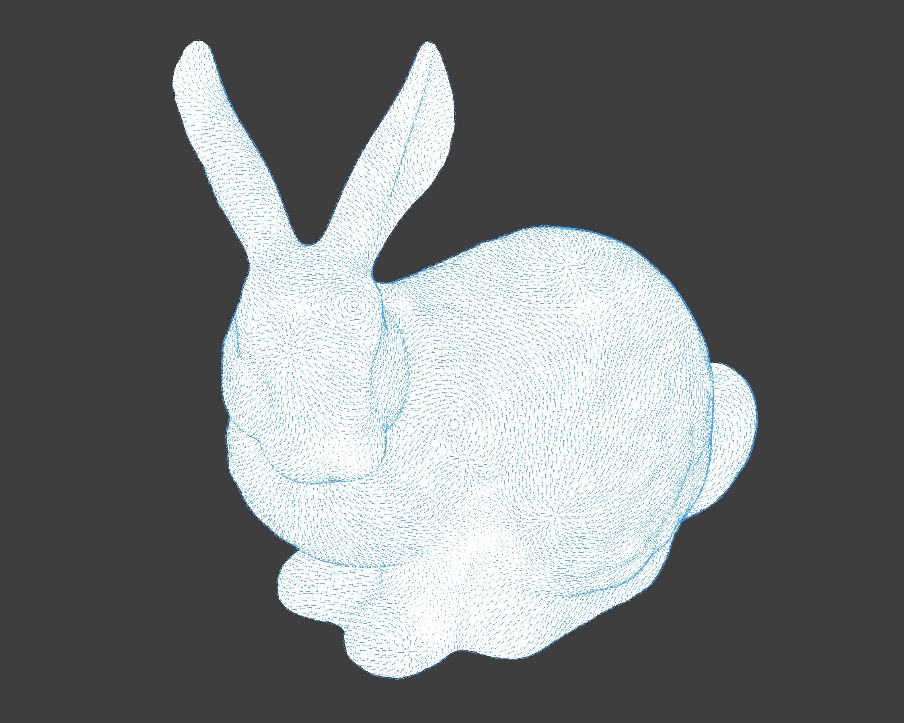

# MonoManifold
Geometry processing library on Unity, specially focusing on differencial geometry.

 

## Features
- Halfedge structure module included
- Curvature culclation (Gausian / Mean / Principal / Normal)
- Poisson equation solver on mesh
- Mesh smoothing based on Poisson eq. 
- Tangent Field Decomposition (Hodge Decomposition)

## References
- [Discrete Differential Geometry: An Applied Introduction - Keenan Crane](https://www.cs.cmu.edu/~kmcrane/Projects/DDG/)

- 森田茂之, 微分形式の幾何学